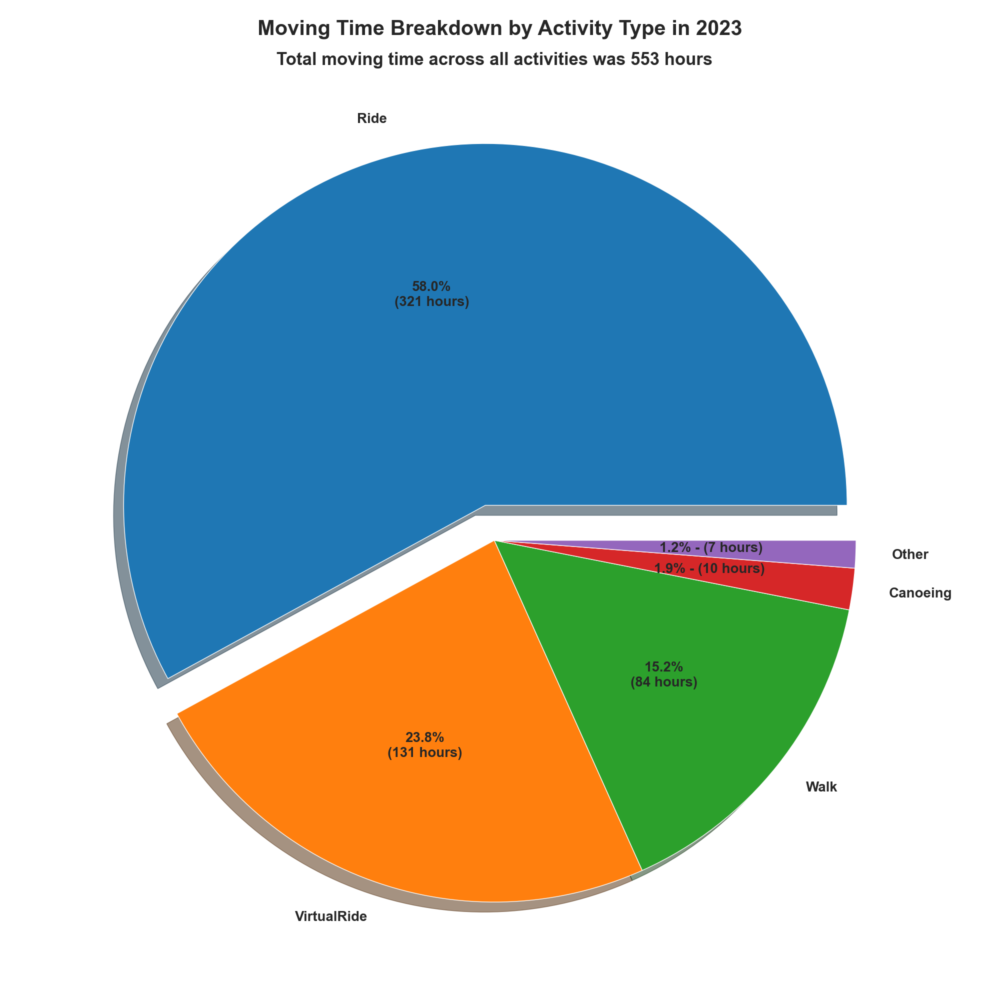

# strava-analysis

This repository contains code for downloading, analyzing, and producing illustrative visualizations of one's own data on Strava. For more details on getting it up and running, what you can do with it, and examples, see my [first](https://biketobass.github.io/computer/python/software/data/strava/fitness/2021/07/13/using-python-to-analyze-strava-data.html), [second](https://biketobass.github.io/computer/python/software/data/strava/fitness/2021/07/22/updates-to-my-python-code-for-strava.html), and [third](https://biketobass.github.io/computer/python/software/data/strava/fitness/datascience/2024/01/18/making-plots-of-strava-data.html) blog posts about it.

The code uses Pandas for analyzing the data and Matplotlib and/or Seaborn for creating figures. For example, this pie chart shows the breakdown of my moving time by activity in 2023. 

The next figure is a bar chart that compares the distance I've ridden each month from 2020-2024. _bar_by_year_month_2020_2021_2022_2023_2024.png)
See [this blog post](https://biketobass.github.io/computer/python/software/data/strava/fitness/2021/07/22/making-plots-of-strava-data.html) for more example visualizations.

The script `get_strava_activities.py` gives several examples for running the code starting with creating a `StravaAnalyzer` object and the various method calls available with it. Currently, the code is able to
* download all of one's activities on Strava and save them to a CSV file
* update that CSV with new activities
* separate the activities by sport type (Ride, Hike, etc.) and create a CSV file for each type
* create a CSV file with summary data for each activity type.
* produce a CSV file for each activity type with summary stats by year
* use past performance to predict the average speed of a route based on its distance and elevation gain
* given an elevation gain and distance, suggest routes that the user completed in the past that have similar elevation and distance profiles
* produce pie charts illustrating percentage of moving time by activity type (new since 1/17/2024)
* produce pie charts that show the breakdown of distance and elevation gain by season for a particular activity (new since 1/17/2024)
* make bar charts comparing distance and elevation gain by year, season, and month (new since 1/17/2024)

If you want to use my code make sure that you have the following packages installed:
* Pandas - the code relies on pandas DataFrames heavily for manipulating the data
* numpy
* requests - for making calls to the Strava API
* json
* time
* dateutil - for handling human readable dates
* pytz - for timezone support
* math
* matplotlib
* webbrowser
* seaborn
* scipy
* scikit-learn

Also make sure that you have `__init__.py` in the same directory as the other python files. This is an empty file whose sole purpose is to let python know to look in the directory when `strava` is imported.

Getting the code to work is a two step process. See my first [blog post about it](https://biketobass.github.io/computer/python/software/data/strava/fitness/2021/07/13/using-python-to-analyze-strava-data.html) for details. My [second blog post](https://biketobass.github.io/computer/python/software/data/strava/fitness/2021/07/22/updates-to-my-python-code-for-strava.html) about the code includes a stripped down review of how to use the code.

Step 1 which you only have to do once is to go through Strava's OAuth 2.0 authorization process. Towards the end of this step you will use `get_strava_tokens.py` to retrieve and store the access and refresh tokens that the rest of the code requires. Step 2 is simply to run `get_strava_activities.py` which instantiates a StravaAnalyzer object as defined in `strava.py`. The first time a StravaAnalyzer is created, the constructor accesses the necessary tokens in order to make a Strava API request. It then downloads all of your activities from the beginning of time to the present and saves them in a CSV file called `strava-activties.csv`. After that, it generates a CSV for each activity type you've recorded (example: Ride.csv, Hike.csv, Kayaking.csv, etc.). It also generates a high level summary CSV file called `strava-summary.csv` and creates a file with annual statistics for each type (Ride-by-year.csv, Hike-by-year.csv, etc.).

As long as you don't delete `strava-activities.csv`, the next time you create an instance of `StravaAnalyzer`, it will check for new activities, append them to `strava-activities.csv` and regenerate the other CSV files. If you do delete `strava-activities.csv`, it downloads everything again for you.

If you'd like see to what profile information Strava stores for you, uncomment the next line of code in `get_strava_activities.py` which calls `get_strava_profile()`. It produces a file called `profile.csv` that contains all of the your profile information.

Edit: 7/15/2021

If you want a prediction of your average speed given the distance and total elevation gain of a route, run the method `predict_avg_speed()`. Uncommenting the first call of this method in `get_strava_activities.py` runs an example in Imperial units (feet of elevation gain and miles of distance). The second call is the same ride but in metric units (meters of elevation gain and kilometers of distance).  See my [blog post](https://biketobass.github.io/computer/python/software/data/strava/fitness/2021/07/13/using-python-to-analyze-strava-data.html) for more details about this method. The default `activity_type` for this method is Ride, but if you want to specify a different activity indicate which one with the `activity_type` parameter (`activity_type="Hike"`, for example). The name of the activity type must match what Strava uses for that activity type. "Hiking" instead of "Hike," for instance, will not work. This method also produces a plot of your average speed versus average elevation gain for your activity type if the `fig_flag` is `True` (default).

Edit: 7/22/2021

Added the `suggest_similar_activities()` method. Given an elevation gain and distance, this method returns (and prints out) a list of URLs of activities you completed in the past that have similar elevation and distance profiles. I find this useful when I'm planning a ride. If, for example, I want to go on a 50 mile ride with 2000 feet of elevation gain, I run `sa.suggest_similar_activities(elev_gain=2000, distance=50)`. This returns a list of my previous activities that have similar elevation and distance. I can expand the search by using the fudge factors that define what it means to be similar. For example, this command `sa.suggest_similar_activities(elev_gain=2000, distance=50, elev_fudge=0.25, dist_fudge=0.25)` will return activities with elevation gain and distance plus or minus 25% of 2000 and 50 respectively. To get suggestions for activities other than rides, use the `activity_type` parameter.

Edit: 9/5/2021

Added the `open_web` flag to `suggest_similar_activities()`. If
`True`, the method will open the Strava activity pages of the similar
routes in new tabs in your default browser. Make sure that you are
logged into Strava if you are using this. I also suggest running the
method first with the flag set to `False`. Otherwise, if the list of
similar activities is long, you may be overwhelmed by new tabs.
